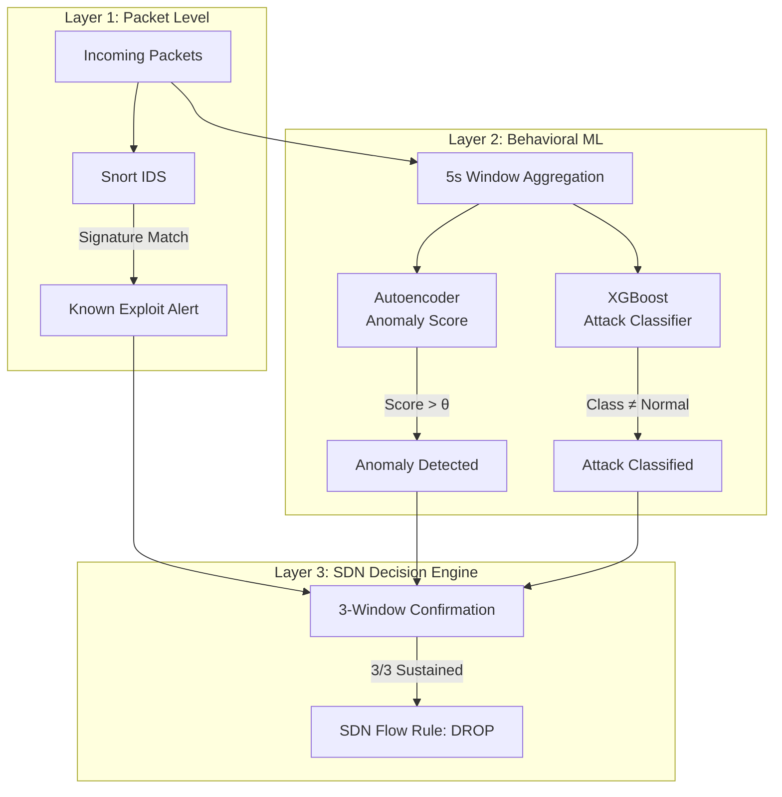

# Hardware-Ready ML Deployment Plan

## Addressing Your Friend's Three Points

Your friend is right about all three concerns. Here's why they're solvable:

### Point 1: "1,337 attack rows isn't enough for deep learning"

**Correct, but irrelevant.** We won't use a deep neural network as a supervised classifier. We'll use:

- **Autoencoder (unsupervised)** — Trained on the **23,275 normal rows ONLY**. It never sees attack labels. It learns to reconstruct normal traffic patterns. When ANY attack arrives (known or zero-day), reconstruction error spikes. Zero attack samples needed.
- **XGBoost (supervised, secondary)** — Tree-based models don't need millions of rows. XGBoost on tabular data with 91 features and 1,337 attack samples will generalize well. This provides attack TYPE classification for known classes.

### Point 2: "Simulated baseline won't match hardware"

**Correct, but your features are designed to self-normalize.** Look at what your 91 features actually measure:

| Feature | Absolute or Relative? | Transfers to Hardware? |
|---|---|---|
| `packets_per_second` | Absolute | ⚠️ Scale will differ |
| `device_pkt_rate_deviation` | **Relative** to device's own avg | ✅ Self-normalizing |
| `inter_arrival_cv` | **Ratio** (std/mean) | ✅ Scale-invariant |
| `network_entropy_src_ip` | **Distribution** metric | ✅ Scale-invariant |
| `src_port_entropy` | **Distribution** metric | ✅ Scale-invariant |
| `device_new_dst_ratio` | **Ratio** | ✅ Scale-invariant |
| `burst_count` | Pattern-based | ✅ Behavior transfers |

~60% of your features are ratios, deviations, entropies, or coefficients of variation — they're **already normalized** against each device's own baseline. They don't care whether the baseline is 50 pps (Mininet) or 200 pps (hardware).

The remaining absolute features (pps, bps, raw counts) DO need calibration. We solve this with a **10-minute hardware baseline** (not a full recollection).

### Point 3: "Metasploit exploits look like normal traffic to behavioral features"

**Absolutely correct. And exactly why you built a dual-layer system.** Your architecture already has:

- **Snort** → Signature matching on packet payloads → Catches Metasploit reverse shells, buffer overflows, known CVEs
- **ML Model** → Behavioral analysis on aggregate features → Catches zero-day volumetric/structural attacks

These aren't competing — they're complementary layers. Metasploit is Snort's job. Zero-day floods and novel scans are the ML model's job.

---

## Architecture Overview



| Layer | What It Catches | Zero-Day? | Example |
|---|---|---|---|
| Snort (signatures) | Known exploits, CVEs | ❌ | Metasploit reverse shell, EternalBlue |
| Autoencoder (anomaly) | ANY traffic deviation | ✅ **Yes** | Novel flood, unknown scan pattern |
| XGBoost (classifier) | Known attack types | ❌ (but helpful) | "This looks like a SYN Flood" |

**The zero-day detection flow:** Autoencoder flags anomaly → XGBoost can't classify it (low confidence) → Controller labels it as **"Unknown Attack"** → 3-window confirmation → Block.

---

## Implementation Plan

### Phase 1: Model Training (Using Existing Dataset)

#### Step 1.1: Feature Preparation

Strip non-feature columns before training:

```python
# Columns to DROP before training
drop_cols = [
    'timestamp', 'src_ip', 'dst_ip', 'src_port', 'dst_port',  # identifiers
    'label', 'attack_type', 'snort_sid',                        # labels
    'meta_window_id', 'meta_src_mac_oui', 'meta_device_name',  # metadata
    'meta_attack_tool', 'meta_attack_intensity',
    'meta_mininet_event', 'meta_controller_load', 'meta_backlog_drops'
]
```

Remaining: **~85 numerical features** (some like `protocol` need encoding).

#### Step 1.2: Train the Autoencoder (Zero-Day Detector)

```
Architecture: 85 → 64 → 32 → 16 (bottleneck) → 32 → 64 → 85
Activation:   ReLU (hidden), Sigmoid (output)
Loss:         MSE (reconstruction error)
Training set: ONLY normal rows (label=0) — 23,275 samples
Validation:   80/20 split of normal rows
```

After training:
- Pass ALL data through (normal + attack)
- Compute reconstruction error for each row
- Normal traffic → low error
- Attack traffic → high error
- Set threshold `θ` at the 99th percentile of normal reconstruction error
- Anything above `θ` = anomaly

> [!IMPORTANT]
> The autoencoder never sees attack labels. It only knows "normal." This is exactly why it can detect zero-day attacks — ANY deviation from normal triggers it.

#### Step 1.3: Train XGBoost Classifier (Known Attack Identifier)

```
Input:    85 features
Output:   7 classes (normal + 6 attack types)
Training: Full dataset with stratified 80/20 split
Params:   scale_pos_weight for class imbalance, max_depth=6, n_estimators=300
```

This model answers: "IF the autoencoder says it's an attack, WHAT KIND of attack is it?"

If XGBoost's confidence is below 0.5 for all known classes → label as **"Unknown/Zero-Day Attack"**.

---

### Phase 2: Hardware Calibration (10-Minute Process)

> [!IMPORTANT]
> This is NOT a full recollection. This is a quick calibration step to bridge the sim-to-real gap.

#### Step 2.1: Collect Hardware Baseline

1. Deploy controller + Snort on the physical gateway
2. Let normal traffic flow for **10 minutes** (no attacks)
3. Collect ~120 windows × ~10 flows/window ≈ **1,200 baseline rows**

#### Step 2.2: Calibrate Autoencoder Threshold

```python
# Pass hardware baseline through the emulation-trained autoencoder
hw_errors = autoencoder.predict(hw_baseline)
hw_reconstruction_errors = compute_mse(hw_baseline, hw_errors)

# Recalibrate threshold for hardware noise floor
theta_hw = np.percentile(hw_reconstruction_errors, 99)
```

This takes the autoencoder trained on emulated data and adjusts its anomaly threshold to account for the hardware's natural noise level. The model weights stay the same — only the decision boundary moves.

#### Step 2.3: (Optional) Fine-Tune Autoencoder

If false positive rate is still too high after threshold calibration:

```python
# Fine-tune for 5-10 epochs on hardware baseline
autoencoder.fit(hw_baseline, hw_baseline, epochs=5, lr=0.0001)
# Then recalculate threshold
```

This is transfer learning — the model adapts its internal representation of "normal" to include hardware-specific noise patterns while retaining the structural knowledge from emulated training.

---

### Phase 3: Integration into SDN Controller

#### Step 3.1: Replace Hardcoded Thresholds with ML Inference

Currently, `_compute_label` in `traffic_capture.py` uses hardcoded rules:
```python
# Current (hardcoded)
if syn_cnt > 300 and ports <= 10:
    detected_type = 'SYN Flood'
elif pps > 5000 and ports <= 5:
    detected_type = 'UDP Flood'
```

Replace with:
```python
# New (ML-driven)
features = extract_features(flow_data, host_counters, device_profile)
anomaly_score = autoencoder.predict(features)

if anomaly_score > theta:
    # Anomaly detected — classify it
    attack_probs = xgboost.predict_proba(features)
    if max(attack_probs) > 0.5:
        detected_type = class_names[argmax(attack_probs)]  # Known attack
    else:
        detected_type = 'Unknown Attack'  # Zero-day!
```

#### Step 3.2: Keep the 3-Window Confirmation System

The existing consecutive-window tracker stays exactly as-is. The ML model replaces WHAT triggers a detection, but the confirmation logic (3/3 sustained windows before blocking) remains the guard against false positives.

```
Window 1: Autoencoder anomaly score > θ → "Suspected" (1/3)
Window 2: Still anomalous                → "Monitoring" (2/3)
Window 3: Still anomalous                → "CONFIRMED"  (3/3) → BLOCK
```

This means even if the autoencoder has a brief false spike from hardware noise, it needs to persist for 15 seconds across 3 consecutive windows to trigger a block. This is your safety net.

#### Step 3.3: Keep Snort as Layer 1

Snort continues to operate independently. If Snort catches a Metasploit exploit (SID match), the controller can escalate immediately without waiting for behavioral ML confirmation — because signature matches have near-zero false positive rates.

---

### Phase 4: Hardware Testing Protocol

#### Test 1: False Positive Validation
- Run normal traffic for 30 minutes on hardware
- Verify: zero false blocks
- If FP rate > 0: tighten threshold or fine-tune autoencoder

#### Test 2: Known Attack Detection
- Run each of the 6 known attack types from a separate machine
- Verify: all detected and blocked within 15 seconds
- Compare with emulated detection performance

#### Test 3: Metasploit (Snort Layer)
- Run Metasploit scripts targeting the gateway
- Verify: Snort triggers alerts
- ML model may or may not fire (depends on traffic volume) — this is expected

#### Test 4: Zero-Day Simulation
- Run an attack type NOT in the training data (e.g., DNS amplification, HTTP slowloris)
- Verify: autoencoder flags anomaly, XGBoost returns low confidence, controller labels "Unknown Attack"
- This is the true zero-day test

---

## Summary: What Each Component Does

| Component | Role | What It Needs | Zero-Day? |
|---|---|---|---|
| Autoencoder | "Is this abnormal?" | 23K normal rows ✅ Have it | ✅ Yes |
| XGBoost | "What type of attack?" | 1.3K labeled rows ✅ Have it | ❌ No (but says "Unknown") |
| Snort | "Is this a known exploit?" | Signature DB ✅ Have it | ❌ No |
| 3-Window Confirmation | "Is this sustained?" | Controller logic ✅ Have it | N/A (safety net) |
| Hardware Calibration | "What's normal HERE?" | 10 min baseline ⏳ Quick step | N/A (threshold tuning) |

> [!TIP]
> Your friend is right that the raw dataset won't work if deployed directly. But the solution isn't "recollect everything on hardware" — it's "train on emulated data + calibrate threshold on hardware." The behavioral patterns (what a flood LOOKS like in feature space) transfer. The absolute noise floor doesn't — but that's a 10-minute calibration, not a multi-day recollection.

## Open Questions

1. **Model format**: Do you want the models saved as `.pkl` (scikit-learn/XGBoost) for direct Python loading in the controller, or exported to ONNX for edge deployment?
2. **Hardware specs**: What is the target gateway device? (Raspberry Pi, x86 mini-PC, etc.) This affects model size constraints.
3. **Snort rule updates**: Should we add custom Snort rules for the specific Metasploit modules you plan to test, or rely on the community ruleset?
